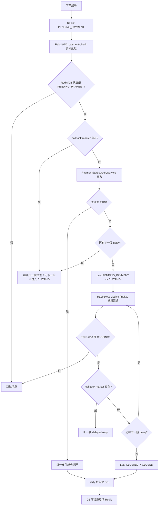
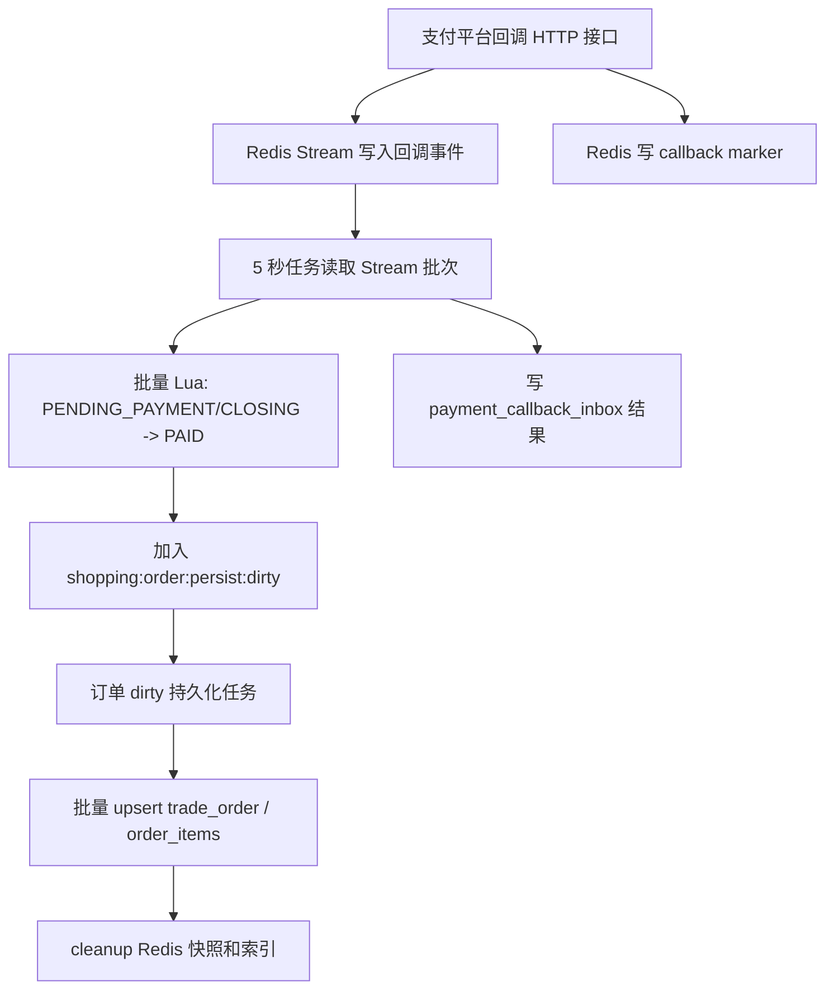
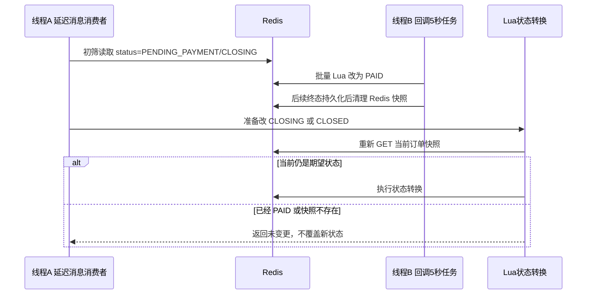

# 订单支付流程说明

本文记录当前项目里的订单支付真实流程，重点说明 `PENDING_PAYMENT`、`CLOSING`、支付回调、RabbitMQ 延迟检查、Redis Stream、Redis ZSET、DB 终态落库，以及并发窗口为什么不会把已支付订单误关单。

## 1. 当前核心规则

- `PENDING_PAYMENT` 和 `CLOSING` 是非终态，当前新流程只保存在 Redis，不主动写入 `trade_order`。
- `PAID`、`CANCELLED`、`CLOSED` 是终态，先写入 Redis 快照并加入 dirty 队列，再由订单持久化任务批量写 DB。
- RabbitMQ 延迟消息不代表订单真实状态，只代表“时间到了，需要检查一次”。
- Redis 订单快照才是 `PENDING_PAYMENT` 和 `CLOSING` 的实时状态来源。
- 下单创建 Redis 订单快照时没有设置 Redis 物理 TTL，生命周期靠逻辑时间、RabbitMQ 检查、dirty 持久化后的 cleanup 控制。

## 2. 状态存储规则

| 状态 | 主要存储位置 | 是否主动写 DB | Redis 清理时机 | 说明 |
| --- | --- | --- | --- | --- |
| `PENDING_PAYMENT` | Redis 订单快照 | 否 | 转为终态并 DB 持久化成功后 | 下单成功后的未支付实时状态 |
| `CLOSING` | Redis 订单快照 | 否 | 转为终态并 DB 持久化成功后 | 未支付检查结束后的关闭缓冲状态 |
| `PAID` | Redis -> DB | 是 | DB 持久化成功后清理 | 支付回调或第三方确认后的支付成功终态 |
| `CANCELLED` | Redis -> DB | 是 | DB 持久化成功后清理 | 用户取消终态 |
| `CLOSED` | Redis -> DB | 是 | DB 持久化成功后清理 | `CLOSING` 缓冲彻底结束后的关闭终态 |

DB 中历史版本已经存在的 `PENDING_PAYMENT` / `CLOSING` 行只作为兼容 fallback 使用。新订单主流程不再主动产生新的 DB 非终态行。

## 3. Redis Key 说明

| Key | 类型 | 作用 |
| --- | --- | --- |
| `shopping:order:detail:{orderNo}` | String | 订单快照，保存订单当前实时状态 |
| `shopping:order:item:{orderNo}` | String | 订单项快照 |
| `shopping:order:user:{userId}:orders` | ZSET | 用户订单索引 |
| `shopping:order:all` | ZSET | 全局订单索引 |
| `shopping:order:expire` | ZSET | 未支付逻辑过期索引 |
| `shopping:order:closing` | ZSET | closing 缓冲截止索引 |
| `shopping:order:persist:dirty` | ZSET | 等待写 DB 的终态订单 |
| `shopping:order:persist:processing` | ZSET | 正在写 DB 的订单 |
| `shopping:payment:callback:stream` | Redis Stream | 支付回调入口缓存，等待 5 秒批量处理 |
| `shopping:payment:callback:received-order:{orderNo}` | String | callback marker，表示该订单已经收到支付回调 |

ZSET 没有被移除。当前仍然使用 ZSET 做订单索引、过期索引、closing 索引和 dirty 持久化索引；只是“定时触发检查”主要由 RabbitMQ delayed-message 完成。

## 4. RabbitMQ 交换机、队列和延迟数组

当前不是“10 秒一个交换机、15 秒一个交换机”。同一类检查使用同一个 delayed exchange，通过消息 header `x-delay` 设置本次延迟。

### 未支付检查

| 配置 | 值 |
| --- | --- |
| Exchange | `order.payment.expire.delay.exchange` |
| Exchange type | `x-delayed-message` |
| Queue | `order.payment.expire.check.queue` |
| Routing key | `order.payment.expire.check` |
| Delay array | `[10000,10000,10000,15000,15000,30000,30000,60000,120000]` |

总时长是 5 分钟。每次消息到期后，如果仍需继续检查，就取消息体里的下一个 delay，再发回同一个 delayed exchange。

### Closing 最终关闭检查

| 配置 | 值 |
| --- | --- |
| Exchange | `order.closing.finalize.delay.exchange` |
| Exchange type | `x-delayed-message` |
| Queue | `order.closing.finalize.check.queue` |
| Routing key | `order.closing.finalize.check` |
| Delay array | `[30000,30000,60000,60000,120000]` |

总时长也是 5 分钟。它只负责 `CLOSING -> CLOSED` 的缓冲检查。

### 旧 TTL/DLQ 兼容

旧的 `order.expire.exchange`、`order.expire.delay.queue`、`order.expire.dlq` 仍保留，用来消费部署前已经进入旧 TTL 队列的消息。新订单的未支付检查和 closing 关闭检查走 delayed-message。

## 5. 下单流程

```text
用户下单
-> 事务中扣库存 / 锁优惠券 / 写优惠券锁定流水
-> Redis 写订单快照，状态为 PENDING_PAYMENT
-> Redis 写订单项快照
-> Redis 写用户订单索引、全局订单索引、expire ZSET
-> RabbitMQ 发送第一段 payment-check delayed-message
-> DB 不写 PENDING_PAYMENT 订单
```

`expireAt` 不是硬编码 5 分钟，而是 `payment-check-delays-millis` 的总和。当前配置总和为 5 分钟。

## 6. `PENDING_PAYMENT -> CLOSING` 多段检查

未支付检查消费者每次被 RabbitMQ 触发后，先做状态初筛：

```text
payment-check 消息到期
-> 查 Redis 订单快照
-> Redis 有快照：使用 Redis 里的 status
-> Redis 没有快照：查 DB，主要用于历史兼容
-> status 不是 PENDING_PAYMENT：直接跳过
-> status 是 PENDING_PAYMENT：继续检查
```

状态仍是 `PENDING_PAYMENT` 时，继续执行：

```text
查 callback marker
-> marker 存在：说明回调已进入系统，继续下一段 delay；如果已经没有下一段，则进入 CLOSING 缓冲
-> marker 不存在：调用 PaymentStatusQueryService
-> 查询结果 PAID：走统一支付成功处理，改 PAID
-> 查询结果 UNPAID / UNKNOWN：有下一段就重发下一段，没有下一段就 startClosing
```

当前真实第三方查询还没有接入。项目里有 `PaymentStatusQueryService` 接口，但默认实现 `SimulatedPaymentStatusQueryService` 返回 `UNKNOWN`。所以当前支付成功主要依赖支付回调链路。

最后准备进入 `CLOSING` 时，不会直接相信消费者第一次读到的旧状态，而是执行 Lua 再校验：

```lua
if not orderJson then
    return {1}
end

if order['status'] ~= 'PENDING_PAYMENT' then
    return {2, order['status'] or ''}
end
```

只有 Redis 当前仍然是 `PENDING_PAYMENT`，才会改成 `CLOSING`。改成 `CLOSING` 后写入 `shopping:order:closing`，并发送第一段 closing-finalize delayed-message。DB 不写 `CLOSING`。

## 7. 支付回调流程

支付回调入口收到回调后，不是直接写订单 DB，而是先进入 Redis 缓冲：

```text
HTTP 支付回调
-> 写 Redis Stream: shopping:payment:callback:stream
-> 写 callback marker: shopping:payment:callback:received-order:{orderNo}
-> 返回 callbackNo
```

callback marker 不是支付流水，也不是订单状态。它只是“这个订单的支付回调已经进入系统”的并发保护标记，TTL 当前默认 10 分钟。

随后 5 秒定时任务处理 Redis Stream：

```text
每 5 秒触发 PaymentCallbackStreamFlushScheduler
-> 批量读取 Redis Stream
-> 批量 claim / dispatch 回调记录
-> 批量执行 Redis Lua: PENDING_PAYMENT / CLOSING -> PAID
-> 写 payment_callback_inbox 处理结果
-> 如果 Redis 快照缺失，走 DB 历史 fallback
-> ack 并删除已处理 Stream 消息
```

回调批处理把 Redis 订单改为 `PAID` 后，会把订单加入 `shopping:order:persist:dirty`。订单真正写入 `trade_order` 由订单终态持久化任务完成。

## 8. `CLOSING -> CLOSED` 多段检查

closing-finalize 消费者每次被 RabbitMQ 触发后，先查 Redis：

```text
closing-finalize 消息到期
-> 查 Redis 订单快照
-> Redis 快照不存在：继续下一段；如果没有下一段，则调用 finalizeClosing 做历史兼容处理
-> Redis 状态不是 CLOSING：直接跳过
-> Redis 状态是 CLOSING：继续检查
```

状态仍是 `CLOSING` 时，先查 callback marker：

```text
查 callback marker
-> marker 存在：说明支付回调已经进入系统，补一次 delayed retry，不立刻 CLOSED
-> marker 不存在且还有下一段 delay：继续下一段
-> marker 不存在且没有下一段 delay：调用 finalizeClosing
```

最后准备进入 `CLOSED` 时，也会执行 Lua 二次校验：

```lua
if not orderJson then
    return {1}
end

if order['status'] ~= 'CLOSING' then
    return {2, order['status'] or ''}
end
```

只有 Redis 当前仍然是 `CLOSING`，并且 `closingDeadlineAtEpochMs` 已到，才会改成 `CLOSED`、加入 dirty，并从 `shopping:order:closing` 移除。

## 9. 终态持久化流程

订单终态持久化任务每 5 秒执行一次：

```text
每 5 秒触发 OrderRedisPersistScheduler
-> 从 shopping:order:persist:dirty claim 一批订单到 processing
-> 批量加载 Redis 订单快照
-> 只保留 PAID / CANCELLED / CLOSED
-> 批量 upsert trade_order
-> 批量写 order_items
-> 成功后 cleanup Redis 快照、订单项和相关 ZSET 索引
```

持久化任务有防御过滤：即使以后有人误把 `PENDING_PAYMENT` 或 `CLOSING` 放入 dirty，也不会写入 DB。

## 10. 并发安全：初筛 + Lua 二次校验

延迟消息消费者第一次查 Redis 只是初筛，不是最终写状态依据。真正状态转换时，Lua 会重新读取 Redis 当前值，并且要求当前状态仍然匹配。

### `PENDING_PAYMENT -> CLOSING`

```text
线程 A：payment-check 消息到期，先读到 Redis 状态是 PENDING_PAYMENT
线程 B：5 秒回调任务刚好把 Redis 状态改成 PAID
线程 B：后续终态持久化成功后清理 Redis 快照
线程 A：继续执行，准备 startClosing
线程 A：startClosing 执行 Lua，Lua 重新 GET Redis
```

如果 Redis 当前已经是 `PAID`，Lua 不会改成 `CLOSING`。如果 Redis 快照已经被清理，Lua 也不会改成 `CLOSING`。

### `CLOSING -> CLOSED`

```text
线程 A：closing-finalize 消息到期，先读到 Redis 状态是 CLOSING
线程 B：5 秒回调任务刚好把 Redis 状态改成 PAID
线程 B：后续终态持久化成功后清理 Redis 快照
线程 A：继续执行，准备 finalizeClosing
线程 A：finalizeClosing 执行 Lua，Lua 重新 GET Redis
```

如果 Redis 当前已经是 `PAID`，Lua 不会改成 `CLOSED`。如果 Redis 快照已经被清理，Redis Lua 不会改；历史 DB fallback 也只会更新 DB 中 `status = 'CLOSING'` 的历史行，不会把 `PAID` 改成 `CLOSED`。

因此并发窗口可能导致多发一条延迟检查消息，或者多做一次无效检查，但不会把已支付订单误改成 `CLOSING` 或 `CLOSED`。

## 11. 主流程图



## 12. 回调流程图



## 13. 并发保护图



## 14. 对话问题汇总

| 问题 | 当前结论 |
| --- | --- |
| 下单后会不会马上写 DB？ | 不会。新订单写 Redis 快照，状态为 `PENDING_PAYMENT`，DB 不写非终态。 |
| `PENDING_PAYMENT` 在哪里？ | 在 Redis 订单快照里，逻辑过期时间也写入快照和 `shopping:order:expire`。 |
| `CLOSING` 在哪里？ | 在 Redis 订单快照里，同时写入 `shopping:order:closing`。DB 不主动写 `CLOSING`。 |
| Redis 订单快照有没有物理 TTL？ | 创建脚本使用 `SET`，没有 `EX`，所以不是靠 Redis TTL 自动删除。 |
| RabbitMQ 消息是不是订单状态？ | 不是。RabbitMQ 只是触发检查，真实状态要重新查 Redis。 |
| 不同 delay 是不是不同交换机？ | 不是。同一类检查使用同一个 delayed exchange，通过 `x-delay` 设置本次延迟。 |
| 支付回调是不是直接写 DB？ | 不是直接改订单 DB。回调先写 Redis Stream 和 callback marker，再由 5 秒任务批量处理。 |
| 5 秒回调任务做什么？ | 批量读 Stream，批量把 Redis 订单改 `PAID`，写 callback inbox，ack/delete Stream 消息。 |
| 订单终态什么时候写 DB？ | 订单进入 `PAID/CANCELLED/CLOSED` 并加入 dirty 后，由订单持久化任务批量写 DB。 |
| callback marker 是支付流水吗？ | 不是。它只是“回调已进入系统”的 Redis 标记。 |
| `PENDING_PAYMENT` 是否查 marker？ | 是。状态仍是 `PENDING_PAYMENT` 时先查 marker。 |
| `CLOSING` 是否查 marker？ | 是。状态仍是 `CLOSING` 时查 marker，存在则补一次 delayed retry，不立刻关单。 |
| 第三方支付查询是否真实可用？ | 当前没有真实实现，默认 `SimulatedPaymentStatusQueryService` 返回 `UNKNOWN`。 |
| 并发会不会误关单？ | 不会。第一次查询只是初筛，真正改状态前 Lua 会重新校验当前状态。 |
| 最坏并发现象是什么？ | 可能多发一条延迟检查消息，或者多做一次无效检查，但不会覆盖 `PAID`。 |

## 15. 源码位置索引

| 主题 | 源码 |
| --- | --- |
| 下单创建和发送 payment-check | `shopping-web/src/main/java/com/example/ShoppingSystem/order/service/OrderCreateService.java` |
| 未支付多段检查 | `shopping-web/src/main/java/com/example/ShoppingSystem/order/service/OrderPaymentExpireCheckService.java` |
| closing 多段检查 | `shopping-web/src/main/java/com/example/ShoppingSystem/order/service/OrderClosingFinalizeCheckService.java` |
| RabbitMQ delayed-message 配置 | `shopping-web/src/main/java/com/example/ShoppingSystem/order/rabbit/OrderExpireRabbitConfig.java` |
| RabbitMQ delay 数组配置 | `shopping-web/src/main/java/com/example/ShoppingSystem/order/rabbit/OrderExpireRabbitProperties.java` |
| RabbitMQ 消息发布 | `shopping-web/src/main/java/com/example/ShoppingSystem/order/rabbit/OrderExpireMessagePublisher.java` |
| 支付回调入口 | `shopping-web/src/main/java/com/example/ShoppingSystem/order/service/PaymentCallbackReceiveService.java` |
| callback marker | `shopping-web/src/main/java/com/example/ShoppingSystem/order/service/PaymentCallbackPendingMarkerService.java` |
| Redis Stream 5 秒 flush | `shopping-web/src/main/java/com/example/ShoppingSystem/order/service/PaymentCallbackStreamFlushScheduler.java` |
| 回调批处理和 inbox 写入 | `shopping-web/src/main/java/com/example/ShoppingSystem/order/service/PaymentCallbackDispatchService.java` |
| 订单终态 5 秒持久化 | `shopping-web/src/main/java/com/example/ShoppingSystem/order/service/OrderRedisPersistScheduler.java` |
| Redis 快照服务 | `shopping-web/src/main/java/com/example/ShoppingSystem/order/service/OrderRedisSnapshotService.java` |
| 创建订单 Redis Lua | `shopping-web/src/main/resources/lua/order_snapshot_create.lua` |
| `PENDING_PAYMENT -> CLOSING` Lua | `shopping-web/src/main/resources/lua/order_snapshot_expire.lua` |
| `CLOSING -> CLOSED` Lua | `shopping-web/src/main/resources/lua/order_snapshot_finalize_closing.lua` |
| 支付回调批量标记 PAID Lua | `shopping-web/src/main/resources/lua/order_snapshot_mark_paid_batch.lua` |
| 应用配置 | `shopping-web/src/main/resources/application.yaml` |
